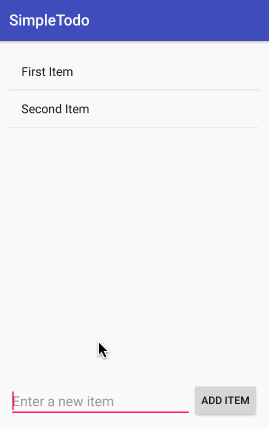
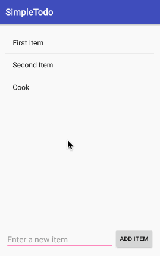

# SimpleTodo
A repository for CodePath X GIT (Girls in Tech Taiwan) Android Bootcamp.

Reference: http://codepath.com/courses/girlsintechtw

## Features
### Add Item
You could use the "ADD ITEM" button below to add a new item.

### Edit Item
You could click an item to edit it.

### Delete Item
You could long-click an item to delete it.

GIFs created with [LiceCap](http://www.cockos.com/licecap/).